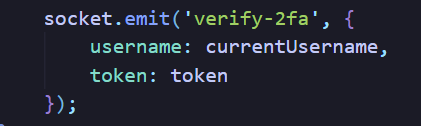

# 2 Factor Authentication System Microservice: 

The microservice allows the user to set up a 2FA for their account in order to add a second line of defense.

A)Clear instructions for how to programmatically REQUEST data from the microservice you implemented. Include an example call. Do not advise your teammate to use your test program or require them to, your teammate must write all of their own code.

To REQUEST data from the microservice, you first have to include the lines "const socket = io();" and "" in your html file in order to use the socket api from nodejs and connect to the socket. Then, in order to request data use "socket.emit('eventName', data')" to send a message/event to the socket. The eventName is a string which is the name of the event and the data can be anything needed for the event. Examples are shown below:

B) Clear instructions for how to programmatically RECEIVE data from the microservice you implemented. Include an example call.

To RECEIVE data from the microservice use the command "socket.on('eventName', callbackFunction(data))" to listen for an event and execute a callback function when the event is received. EventName is the name of the event that you want to listen for and the callbackFunction is what you want to do when the event is called with the given data. Examples are shown below: 

C) UML sequence diagram showing how requesting and receiving data works. Make it detailed enough that your teammate (and your grader) will understand.

